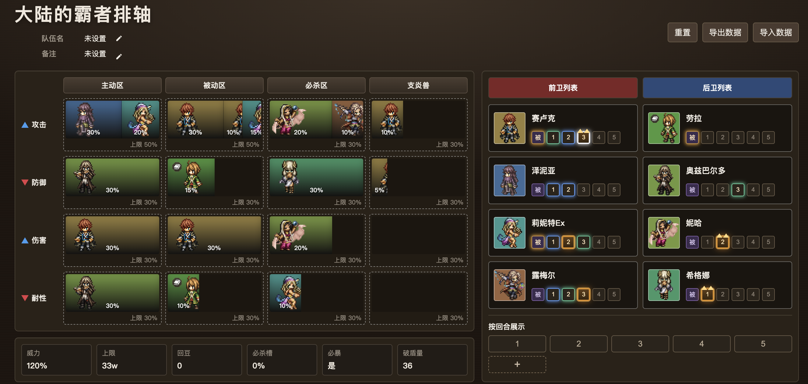
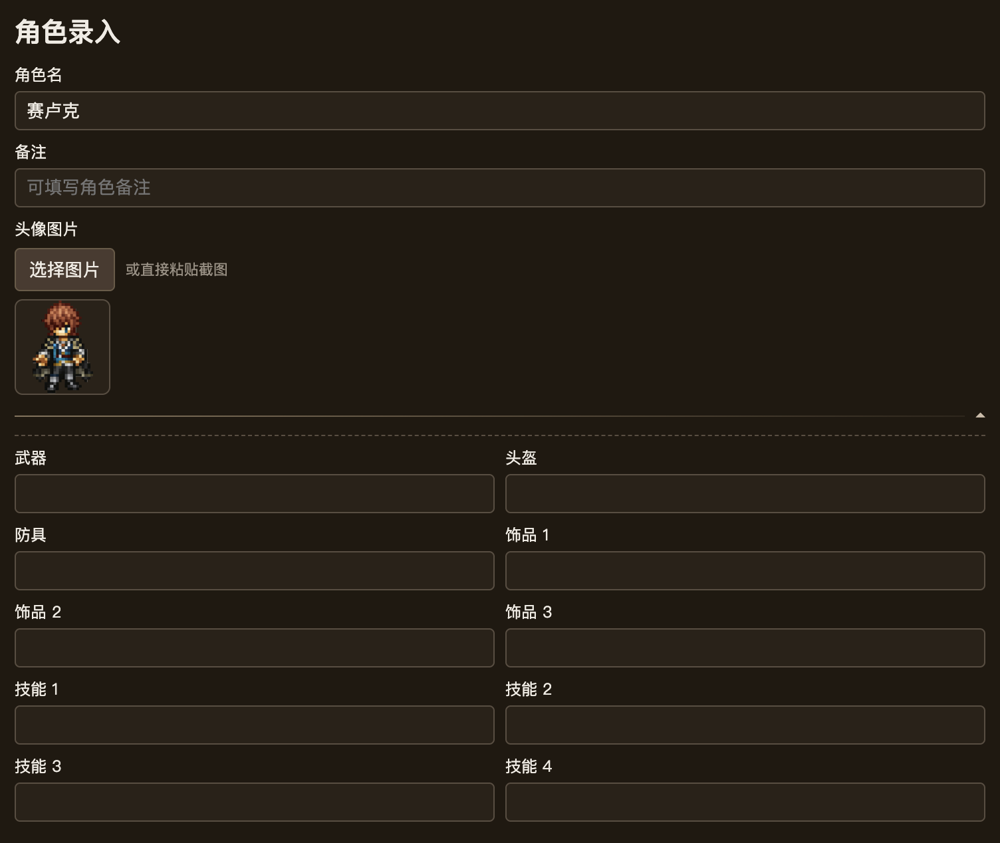
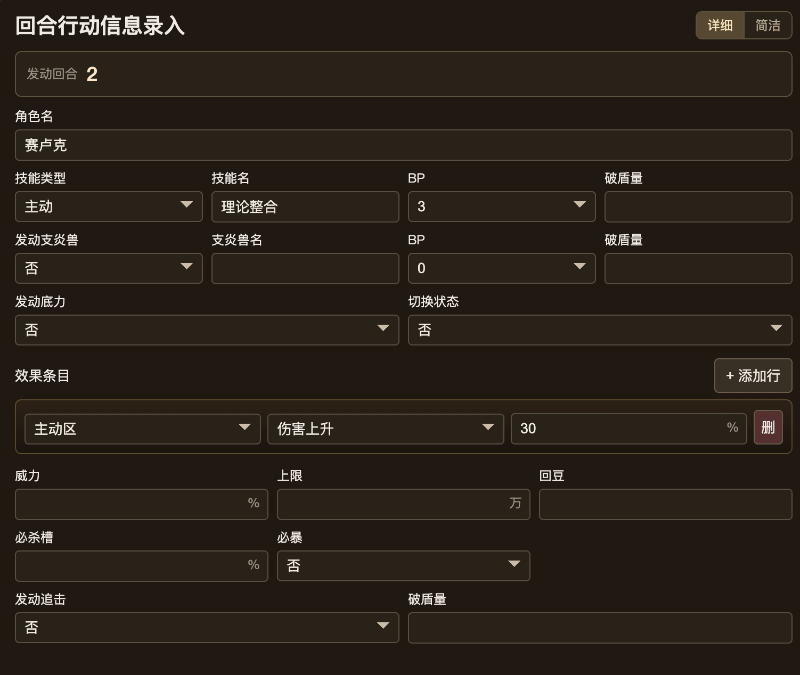
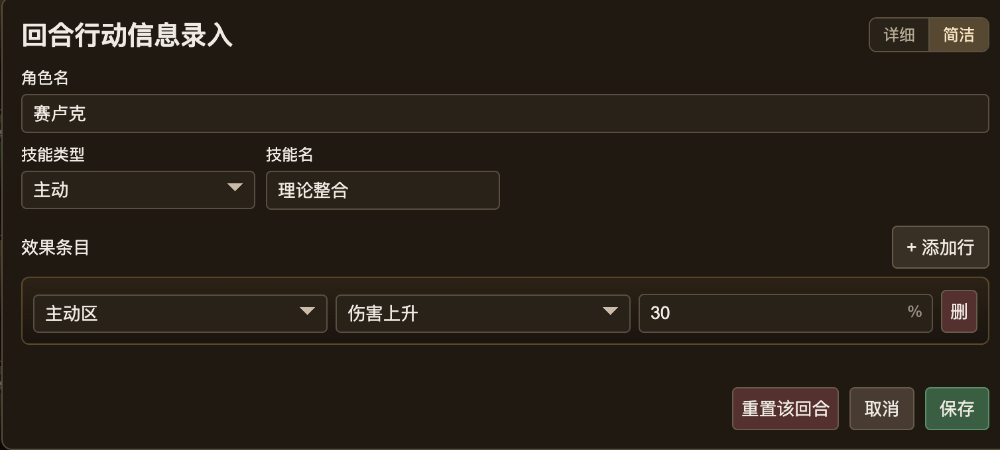
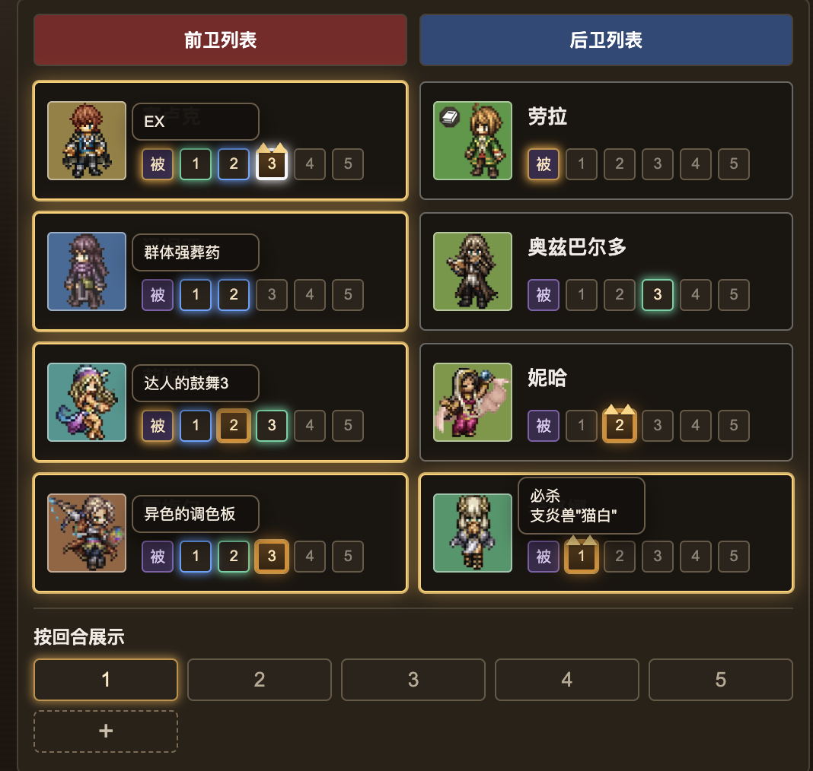
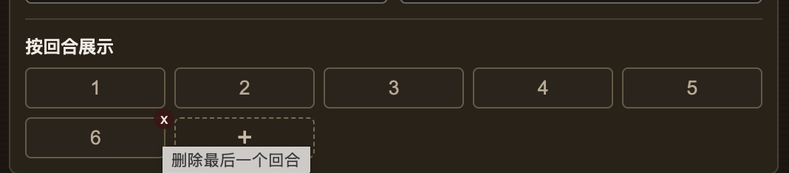

# 歧路旅人：大陆的霸者 排轴工具

> 本项目仅供交流学习与个人使用，未经作者授权，严禁任何形式的商业盈利行为。

用于录入角色、回合行动、收益效果并可视化排轴的前端小工具。  
项目为纯前端页面，无后端依赖，数据保存在浏览器本地并支持导入/导出。

## 项目结构

- `paiZhouUtil/index.html`：页面结构
- `paiZhouUtil/styles.css`：样式
- `paiZhouUtil/app.js`：交互逻辑、状态管理、持久化
- `data/`：可选数据目录（我放了示例队伍）
- `docs/screenshots/`：README 截图目录

## 核心功能

- 8 格队伍面板（前卫/后卫）与头像、备注、角色扩展信息录入
- 回合行动录入（详细/简洁模式切换）
- 效果条目投放到主动/被动/必杀/支炎兽区
- 收益区与额外收益自动汇总
- 按回合高亮展示
- 回合图标与角色卡拖拽交换
- 回合数量动态增减（含删除最后回合二次确认）
- 本地持久化 + JSON 导入导出（导出文件名跟随队伍名）

## 运行方式

### 方式一：直接打开

直接双击 `paiZhouUtil/index.html` 即可使用。

### 方式二：本地静态服务

在仓库根目录执行：

```bash
python3 -m http.server 8080
```

然后访问：`http://localhost:8080/paiZhouUtil/index.html`

## 操作步骤（建议流程）

1. 在顶部填写 `队伍名` 和 `备注`（点右侧铅笔图标编辑）。
2. 点击队伍头像位，进入 `角色录入`，填写角色名、头像、备注与可选扩展装备/技能信息。
3. 点击 `被` 图标录入被动与装备效果（效果条目）。
4. 点击某个回合图标录入回合行动：
   - 可切换 `详细 / 简洁` 录入模式（全局生效）
   - 填写技能、支炎兽、追击、底力/切换状态等信息
5. 在收益区确认效果累计、上限与额外收益统计。
6. 使用底部 `按回合展示` 过滤查看某一回合生效角色与提示信息。
7. 通过 `导出数据` 保存 JSON；需要时使用 `导入数据` 恢复。

## 截图说明

### 1) 主界面



### 2) 角色录入



### 3) 回合录入（详细）



### 4) 回合录入（简洁）



### 5) 按回合展示与提示



### 6) 动态回合增删



## 数据说明

- 本地存储键：`paiZhouUtilData.v1`
- 主要持久化内容：
  - 队伍数据（角色、头像、被动、回合行动）
  - 队伍名、备注
  - 回合总数
  - 回合录入视图模式（详细/简洁）
  - 收益格上限

## 注意事项

- 删除最后回合会清空该回合所有角色行动，请确认后执行。
- 如需版本迭代，建议每次调整后先导出 JSON 备份。 

